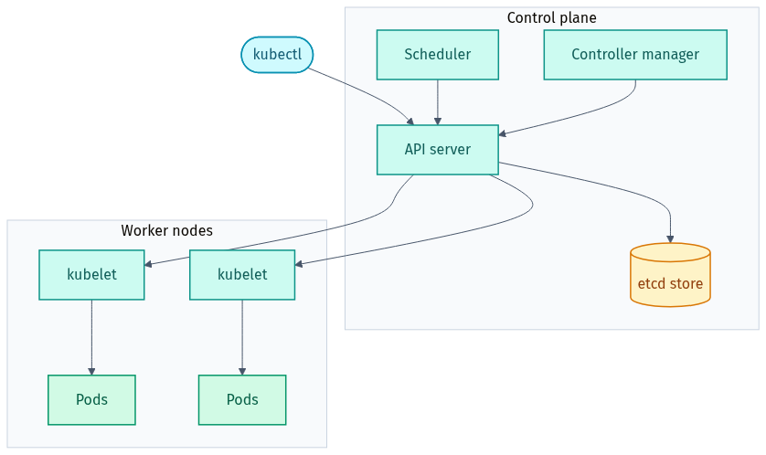

# Part 1 — Kubernetes Basics (Warm-up)

*The cluster: a control plane that decides, worker nodes that run your Pods:*

<picture><source media="(prefers-color-scheme: dark)" srcset="../docs/04-cluster-architecture-dark.png"></picture>

## 🎯 Goal
Build the mental model and the `kubectl` muscle memory you need for everything else. By the end you'll be able to *look at any cluster and understand what's going on*.

---

## 🧠 The concepts, in plain English

Read this once slowly. The rest of the lab is just applying these.

### 1. Kubernetes is a "desired-state" engine
You never say *"run this container now"*. You give Kubernetes a description of the world you want (*"3 copies of nginx, reachable on port 80"*) and a **control loop** works continuously to make reality match. This is why Kubernetes can "self-heal": if a Pod dies, the loop notices reality ≠ desired and creates a new one.

### 2. A Pod is the smallest thing that runs
A **Pod** wraps one container (sometimes a few that must live together). All containers in a Pod share the same network address and can talk over `localhost`. Important: **Pods are disposable**. They get a random name, they can be deleted and recreated at any time, and they get a new IP each time. So you almost never create Pods directly.

### 3. A Deployment manages Pods for you
A **Deployment** is what you actually write. You tell it *"keep 3 Pods of this template running"* and it handles the rest through a **ReplicaSet** (the thing that keeps the count correct). The Deployment also gives you **rolling updates** (swap to a new version with no downtime) and **rollbacks** (go back if it breaks).

> Chain to remember: **Deployment → ReplicaSet → Pods → containers.**

### 4. A Service gives a stable address
Pods come and go and change IPs, so you can't rely on a Pod's IP. A **Service** is a fixed name and virtual IP that automatically load-balances to whichever Pods currently match its **label selector**. Think of it as a permanent front door for a constantly-changing set of rooms.

> This *label selector* link is the single most common thing that's misconfigured. The Service finds Pods by matching labels — if the labels don't match, the Service points to nothing.

### 5. ConfigMaps and Secrets keep config out of the image
You don't bake config into your image (that would mean rebuilding for every change). A **ConfigMap** holds plain config; a **Secret** holds sensitive values. Both can be injected into a Pod as environment variables or mounted as files.

### 6. Namespaces group things
A **Namespace** is like a folder. `default` is where things go if you don't pick one. System components live in `kube-system`. Use namespaces to separate teams or environments.

### 7. Labels and selectors are the glue
Almost every connection in Kubernetes is "find the objects with these labels". Services find Pods by labels. Deployments track their Pods by labels. Get comfortable with `app: hello`-style labels.

---

## 📝 Tasks
Run each command and read what comes back. Answers/explanations are at the bottom. (These use the public `nginx` and `busybox` images.)

1. **See the cluster.** Show the nodes and confirm at least one is `Ready`.
2. **Create a Deployment** named `hello` from the `nginx:1.27-alpine` image (imperative one-liner is fine here).
3. **Watch Pods appear.** List the Pods, then list them again with more detail (node + IP).
4. **Inspect a Pod.** Describe one of the `hello` Pods and find the **Events** section at the bottom.
5. **Read logs.** Show the logs of one `hello` Pod.
6. **Scale up.** Change the Deployment to 3 replicas and watch the new Pods appear.
7. **Self-healing demo.** Delete one Pod and watch Kubernetes immediately replace it.
8. **Expose it.** Create a Service for the Deployment on port 80, then reach it with `port-forward`.
9. **Get inside.** Open a shell in a Pod and `curl localhost` (or use `wget`).
10. **Clean up.** Delete the Deployment and the Service.

---

## ✅ Answers & explanations

```bash
# 1. See the cluster
kubectl get nodes
#   STATUS should be "Ready". One node is fine for a local cluster.

# 2. Create a Deployment (imperative — quick for warm-ups)
kubectl create deployment hello --image=nginx:1.27-alpine
#   This creates a Deployment -> ReplicaSet -> 1 Pod.

# 3. Watch Pods appear
kubectl get pods                # NAME like hello-xxxxxxxxx-yyyyy
kubectl get pods -o wide        # adds NODE and IP columns
#   Tip: `kubectl get pods -w` streams live changes (Ctrl-C to stop).

# 4. Inspect a Pod (replace with your real Pod name)
kubectl describe pod <hello-pod-name>
#   Scroll to "Events" at the bottom — Pulled, Created, Started.
#   describe is your #1 debugging tool. Events explain WHY a Pod is unhappy.

# 5. Read logs
kubectl logs <hello-pod-name>
#   nginx prints its startup/access logs here.

# 6. Scale up
kubectl scale deployment hello --replicas=3
kubectl get pods            # now 3 Pods; the ReplicaSet created 2 more

# 7. Self-healing demo
kubectl delete pod <one-hello-pod-name>
kubectl get pods            # a NEW Pod appears within seconds — desired state = 3
#   You didn't ask for a new Pod; the control loop made reality match "3".

# 8. Expose it with a Service
kubectl expose deployment hello --port=80 --target-port=80
kubectl get svc hello
kubectl port-forward svc/hello 8080:80
#   In another terminal:  curl http://localhost:8080   (Ctrl-C to stop forwarding)

# 9. Get inside a Pod
kubectl exec -it <hello-pod-name> -- sh
#   (inside)  wget -qO- localhost     # nginx welcome HTML
#   (inside)  exit

# 10. Clean up
kubectl delete service hello
kubectl delete deployment hello
```

> 🧩 **Imperative vs declarative.** The commands above (`create`, `expose`, `scale`) are *imperative* — handy for quick experiments. The real job is *declarative*: you write YAML and `kubectl apply -f`. Part 2 switches to YAML, which is what interviews and real work use. A great trick: add `--dry-run=client -o yaml` to any `create` command to generate a starter manifest:
>
> ```bash
> kubectl create deployment hello --image=nginx:1.27-alpine --dry-run=client -o yaml
> ```

➡️ When you're comfortable inspecting a cluster, move on to [Part 2 — Core Workloads](../02-core-workloads/README.md).

---

## ⭐ Found this useful?
Please **star** ⭐, **fork** 🍴, and **share** 🔗 this repo on LinkedIn so others can use it too. Want to add a task or fix something? See [CONTRIBUTING.md](../CONTRIBUTING.md).

Made by **Shubham Sharma** · [GitHub](https://github.com/shubhs248) · [LinkedIn](https://www.linkedin.com/in/shubhs248)
