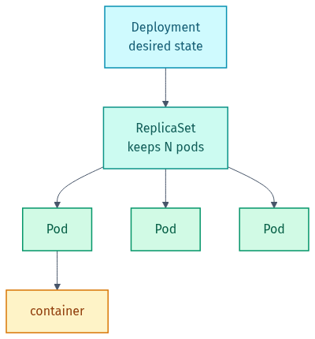
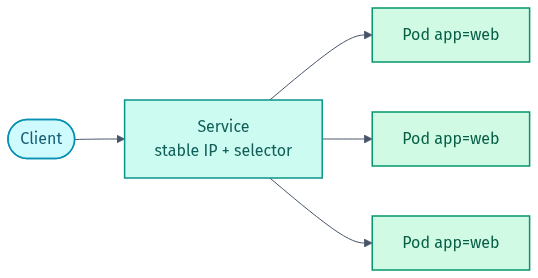

# Part 2 — Core Workloads

*Deployment → ReplicaSet → Pods — the chain that keeps your app running:*

<picture><source media="(prefers-color-scheme: dark)" srcset="../docs/01-deployment-hierarchy-dark.png"></picture>

*A Service gives a stable address and routes to Pods by label:*

<picture><source media="(prefers-color-scheme: dark)" srcset="../docs/02-service-routing-dark.png"></picture>

## 🎯 Goal
Write the manifests you'll use 90% of the time **by hand**, from a spec — a Pod, a Deployment, a Service, a ConfigMap, and a Secret. Writing YAML from scratch (not copy-pasting) is exactly what gets tested in interviews.

## 🧠 What you practise here
- The **shape** every manifest shares: `apiVersion`, `kind`, `metadata`, `spec`.
- Why you use a **Deployment** instead of a bare **Pod**.
- How a **Service** finds Pods through a **label selector**.
- Injecting config with a **ConfigMap** and sensitive values with a **Secret**.

### The shape of every manifest
Every Kubernetes object has the same four top-level keys:

```yaml
apiVersion: apps/v1     # which API group/version defines this kind
kind: Deployment        # what type of object
metadata:               # name, labels, namespace
  name: hello
spec:                   # the desired state — the meat of the object
  ...
```

Learn this shape once and every new object type is just "what goes in `spec`".

---

## 📝 The 3 exercises

| # | File | What you practise |
|---|------|-------------------|
| 1 | `exercise-1-pod-and-deployment.md` | a bare Pod, then the same app as a Deployment (and why) |
| 2 | `exercise-2-service-and-expose.md`  | a Service with a label selector + reaching the app |
| 3 | `exercise-3-config-and-secrets.md`  | inject a ConfigMap (as a file) and a Secret (as env vars) |

For each one, **write your own YAML**, apply it, verify, then compare with [`solutions/`](solutions):

```bash
# validate without touching the cluster
kubectl apply --dry-run=client -f my-deployment.yaml

# really apply it
kubectl apply -f my-deployment.yaml

# check
kubectl get pods,svc
kubectl describe deployment hello
```

> 💡 Stuck on a field name? `kubectl explain deployment.spec.template.spec.containers` prints the built-in docs for any path. No internet needed.

➡️ Next: [Part 3 — Operating & Debugging](../03-operating-and-debugging/README.md).

---

## ⭐ Found this useful?
Please **star** ⭐, **fork** 🍴, and **share** 🔗 this repo on LinkedIn so others can use it too. Want to add an exercise or fix something? See [CONTRIBUTING.md](../CONTRIBUTING.md).

Made by **Shubham Sharma** · [GitHub](https://github.com/shubhs248) · [LinkedIn](https://www.linkedin.com/in/shubhs248)
