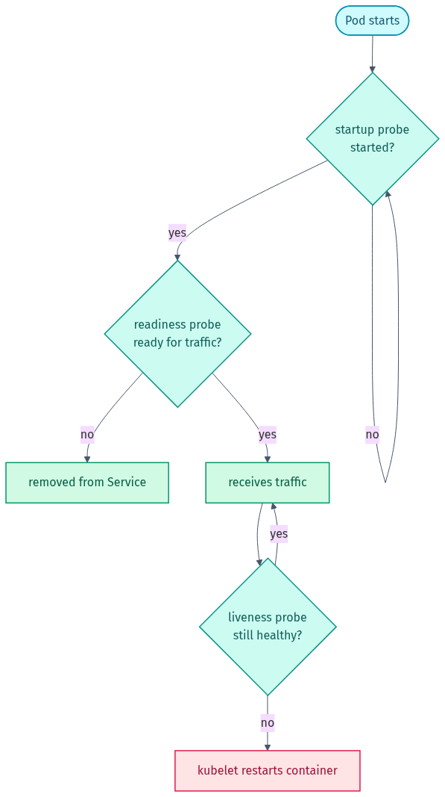

# Part 3 — Operating & Debugging

*The probe lifecycle — startup gates, readiness controls traffic, liveness restarts:*

<picture><source media="(prefers-color-scheme: dark)" srcset="../docs/03-probes-dark.png"></picture>

## 🎯 Goal
Run a deployed app like you would on the job: **scale** it, **roll out** a new version (and **roll back** a bad one), give it **health probes**, and — the part that really matters — **diagnose and fix Pods that are broken**. This section is where interviews are won.

## 🧠 What you practise here
- Scaling and what a **rolling update** actually does (and how to undo it).
- **Liveness, readiness, and startup probes** — what each one is for.
- The **debugging loop** every operator runs on autopilot.
- The three failures you'll see most: **ImagePullBackOff**, **CrashLoopBackOff**, and a **Service with no endpoints**.

### The debugging loop (burn this into memory)
Whenever something is wrong, you run the same four steps:

1. **`kubectl get pods`** — what's the **STATUS**? The status name basically tells you the category of problem.
2. **`kubectl describe pod <name>`** — read the **Events** at the bottom. This is where Kubernetes tells you *why*.
3. **`kubectl logs <pod>`** (add `--previous` if it already crashed) — what did the *application* say?
4. If a **Service** is involved: **`kubectl get endpoints <svc>`** — empty endpoints means the selector doesn't match any Pod labels.

| STATUS | Category of problem |
|--------|---------------------|
| `ImagePullBackOff` / `ErrImagePull` | Kubernetes can't pull the image (bad name/tag or auth) |
| `CrashLoopBackOff` | the container starts then exits/errors repeatedly |
| `Pending` | can't be scheduled (not enough CPU/mem, or no matching node) |
| `Running` but unreachable | networking: Service selector / `targetPort` mismatch |

---

## 📝 The 3 exercises

| # | File | What you practise |
|---|------|-------------------|
| 1 | `exercise-1-scaling-and-rollouts.md` | scale, rolling update, rollback |
| 2 | `exercise-2-health-probes.md`        | readiness + liveness (+ startup) probes |
| 3 | `exercise-3-debug-broken-pods.md`    | diagnose & fix 3 deliberately broken manifests |

The broken manifests live in [`broken/`](broken); the fixed versions and probe/rollout examples are in [`solutions/`](solutions). **Try to diagnose before you peek at the fix** — diagnosing is the skill.

➡️ Finished? Test yourself with the [Interview Questions](../INTERVIEW-QUESTIONS.md).

---

## ⭐ Found this useful?
Please **star** ⭐, **fork** 🍴, and **share** 🔗 this repo on LinkedIn so others can use it too. Want to add an exercise or fix something? See [CONTRIBUTING.md](../CONTRIBUTING.md).

Made by **Shubham Sharma** · [GitHub](https://github.com/shubhs248) · [LinkedIn](https://www.linkedin.com/in/shubhs248)
